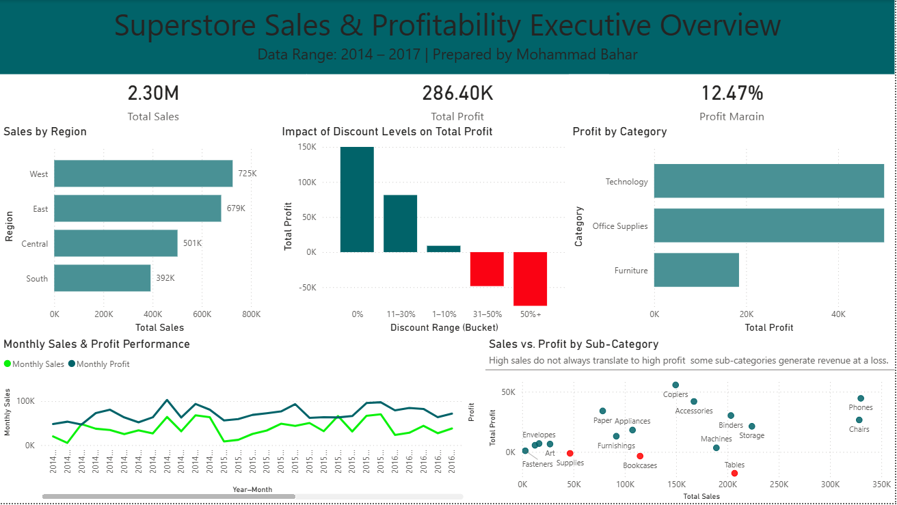

# Superstore Sales Analytics Dashboard

## Project Overview

This project delivers an end-to-end sales and profitability analysis for a retail superstore using **Python**, **SQL**, and **Power BI**.  
The goal was to move beyond static spreadsheets and build a scalable, query-driven analytics pipeline that supports executive-level decision-making.

A Python validation layer ensures data quality and generates automated insights before SQL ingestion, while a SQL-based semantic layer powers an interactive dashboard that highlights revenue trends, profitability drivers, regional performance, and the financial impact of discounting strategies.

---

## Business Problem

Retail leadership needed a clear understanding of:

- Which product categories and regions drive profitability
- How discounting affects margins
- Why high sales volume does not always translate to high profit
- How performance trends evolve over time

---

## Dashboard Preview



---

## Tech Stack

* **Data Source:** Kaggle – Superstore Sales (Final)
* **Data Preparation:** Microsoft Excel (initial cleaning)
* **Data Validation:** Python (Pandas, NumPy), Python (validation & enrichment)
* **Database:** SQLite
* **Query Language:** SQL
* **Visualization:** Power BI
* **Version Control:** Git & GitHub

---

## Project Architecture
```
superstore-sales-analytics/
│
├── data/
│   ├── Sample - Superstore.csv
│   ├── Superstore Cleaned.csv
│   ├── Superstore_Final_Cleaned.csv
│   └── python_validation_report.txt
│
├── python/
│   ├── validator.py
│   
│
├── sql/
│   ├── create_table.sql
│   ├── Kpi_queries.sql
│   └── create_views.sql
│
├── dashboard/
│   └── Superstore_Sales_Dashboard.pbix
│
├── screenshots/
│   └── dashboard_preview.png
│
├── docs/
│   └── data_dictionary.md
│
└── README.md
```

---

## Data Pipeline Workflow
```
Raw CSV → Excel Cleaning → Python Validation → SQLite Database → Power BI Dashboard
```

### Python Validation Layer

Automated data quality assurance pipeline that validates the Excel-cleaned dataset before SQL ingestion.

**Run the pipeline:**
```bash
python python/validator.py
```

**What it does:**
- Validates data quality (missing values, duplicates, invalid ranges)
- Adds 8 calculated fields (Year, Quarter, Month, Profit Margin, Discount Bands, Sales Tiers)
- Generates automated business insights report

**Validation Results:**
- 9,994 rows processed with 0 data quality issues
- 66 extreme loss transactions flagged (>200% negative margin)
- Identified $17,725.59 in Tables sub-category losses
- Discovered 31% discount threshold where profitability turns negative

---

## Key Analytical Insights

- Generated **$2.3M in total sales** with a **12.47% profit margin** across four years (2014–2017).
- Identified **Technology** as the most profitable category (15.61% avg margin), while **Furniture** underperformed (3.88% avg margin) despite strong sales volume.
- Python validation revealed **discounts above 31% consistently drive negative margins**: 32-50% discounts average -29.61% margin, while 50%+ discounts average -113.88% margin.
- Discovered **three loss-making sub-categories**: Tables ($-17,725.59), Bookcases ($-3,472.56), and Supplies ($-1,188.99).
- Regional analysis showed the **West and East regions** as top profit contributors at $108,419 and $91,523 respectively.

---

## SQL Semantic Layer

To improve performance and reusability, the dashboard is powered by a SQL semantic layer composed of analytical views:

- `vw_overall_kpis` – Executive KPIs (Sales, Profit, Margin)
- `vw_monthly_performance` – Time-series trends
- `vw_region_performance` – Geographic analysis
- `vw_category_performance` – Category-level profitability
- `vw_discount_impact` – Discount vs. profit diagnostics

This approach separates business logic from visualization, enabling scalable analytics.

---

## How to Run This Project

1. Run Python validation: `python python/validator.py` to generate `Superstore_Final_Cleaned.csv`
2. Load the validated CSV into SQLite using the schema in `sql/create_table.sql`
3. Execute SQL scripts in the `/sql` folder to create analytical views
4. Open `dashboard/Superstore_Sales_Dashboard.pbix` in Power BI
5. Refresh data connections if needed

---

## Why This Project Matters

This project demonstrates:

- Automated data validation and quality assurance using Python
- Strong SQL fundamentals and data modeling
- Business-focused analytical thinking with quantified impact ($17K+ losses identified)
- Clean dashboard design for executive audiences
- An end-to-end analytics workflow similar to real-world BI teams

---

## License

This project is licensed under the MIT License.
